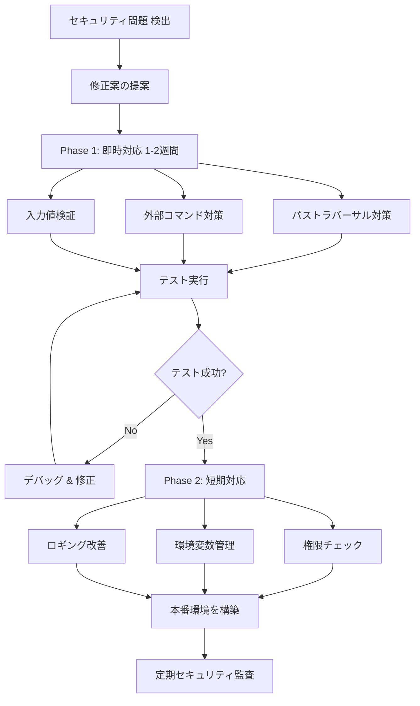

# セキュリティベストプラクティスガイド

## 概要

このドキュメントは、`local-llm-file-search` プロジェクトのセキュリティを強化するための実装ガイドです。

---

## 🔐 実装チェックリスト

### Phase 1: 即時対応（1-2週間）

- [ ] **最高優先度**: `archive_list_fixed.py` の実装
  - [ ] `_has_path_traversal()` メソッドをコピー
  - [ ] 外部コマンド実行を `shell=False` に修正
  - [ ] タイムアウト設定を追加
  - [ ] テストケースを実行

- [ ] **高優先度**: `query_fixed.py` の実装
  - [ ] 入力値検証ロジックをコピー
  - [ ] エラーメッセージを汎用化
  - [ ] ログレベルを適切に設定

- [ ] **高優先度**: セキュリティスキャナーの実行
  ```bash
  python security_checker.py ./backend
  ```

### Phase 2: 短期対応（1ヶ月）

- [ ] ファイルアクセス権限チェック実装
  ```python
  # scanner.py に追加
  if not os.access(self.root_path, os.R_OK):
      logger.error(f"No read permission for: {self.root_path}")
      return []
  ```

- [ ] 環境変数ベースの設定管理
  ```python
  from dotenv import load_dotenv
  load_dotenv()
  
  SCAN_PATH = os.getenv('SCAN_PATH', './data/raw')
  DB_PATH = os.getenv('DB_PATH', './data/index')
  ```

- [ ] ロギングシステムの改善
  - [ ] ログレベルを環境変数で制御
  - [ ] ログファイルのパーミッション設定（0o600）
  - [ ] 機密情報をログから除外

- [ ] 依存パッケージのバージョン固定
  ```bash
  pip freeze > requirements.lock
  ```

### Phase 3: 中期対応（2-3ヶ月）

- [ ] セキュリティテストスイートの追加
- [ ] SBOM（Software Bill of Materials）の作成
- [ ] 定期セキュリティ監査の実施
- [ ] インシデント対応計画の策定

---

## 🛡️ 各ファイルの修正方法

### 1. archive_list.py の修正

**現在**: `_has_path_traversal()` メソッドが実装されていない

**修正方法**:
```bash
# archive_list_fixed.py から _has_path_traversal() メソッドをコピー
# または既存の archive_list.py を archive_list_fixed.py で置き換える

cp backend/archive_list_fixed.py backend/archive_list.py
```

### 2. query.py の修正

**現在**: エラーメッセージに詳細情報が含まれる

**修正方法**:
```bash
# query_fixed.py の改善をマージ
# 入力値検証ロジックと安全なエラーハンドリングをコピー

cp backend/query_fixed.py backend/query.py
```

### 3. scanner.py の修正

**現在**: ファイルアクセス権限チェックが不足

**修正方法**:
```python
# scan() メソッドの開始位置に追加:

def scan(self) -> List[Dict]:
    """
    ドライブ/フォルダを再帰走査
    
    Returns:
        メタデータのリスト
    """
    logger.info(f"Scanning: {self.root_path}")
    
    # ✅ 権限チェック追加
    try:
        if not os.access(self.root_path, os.R_OK):
            logger.error(f"No read permission for: {self.root_path}")
            return []
    except Exception as e:
        logger.error(f"Permission check failed: {e}")
        return []
    
    if not os.path.exists(self.root_path):
        logger.error(f"Path not found: {self.root_path}")
        return []
    
    # 以下、既存コード
```

### 4. requirements.txt の修正

**現在**:
```
chromadb>=0.4.0
pyyaml>=6.0
```

**修正後**:
```
# より厳密なバージョン固定
chromadb>=0.4.0,<1.0.0
pyyaml>=6.0,<7.0.0
pillow>=10.0.0,<11.0.0
ollama>=0.1.0,<1.0.0
requests>=2.28.0,<3.0.0
python-dotenv>=1.0.0,<2.0.0
mutagen>=1.46.0,<2.0.0
```

---

## 📋 環境変数設定

秘密情報と設定を環境変数に移行するための `.env` テンプレート:

```bash
# スキャン対象パス
SCAN_PATH=F:\

# ベクトルDB パス
VECTORDB_PATH=./data/index

# ログレベル (DEBUG, INFO, WARNING, ERROR)
LOG_LEVEL=INFO

# ログファイルパス
LOG_FILE=./logs/app.log

# Ollama 設定
OLLAMA_BASE_URL=http://localhost:11434
OLLAMA_MODEL=mistral

# セキュリティ設定
ARCHIVE_MAX_ENTRIES=50000
ARCHIVE_MAX_SIZE_GB=50
TEXT_MAX_SIZE_BYTES=1048576
TEXT_ENCODING_ERRORS=ignore
```

**.env.template** (リポジトリに含める):
```bash
# Copy this file to .env and configure values
SCAN_PATH=
VECTORDB_PATH=./data/index
LOG_LEVEL=INFO
LOG_FILE=./logs/app.log
OLLAMA_BASE_URL=http://localhost:11434
OLLAMA_MODEL=mistral
```

**.gitignore に追加**:
```
.env
.env.local
logs/
*.log
```

---

## 🔍 セキュリティテストの実施

### 1. パストラバーサル検出テスト

```python
# backend/archive_list_fixed.py の _has_path_traversal() をテスト
from backend.archive_list_fixed import ArchiveListExtractor

extractor = ArchiveListExtractor({'archive_max_entries': 50000, 'archive_max_size_gb': 50})

dangerous_paths = [
    '../../../etc/passwd',
    '..\\..\\windows\\system32',
    '/etc/passwd',
    'C:\\Windows\\System32'
]

for path in dangerous_paths:
    assert extractor._has_path_traversal(path), f"Failed to detect: {path}"

print("✅ パストラバーサル検出テスト: PASS")
```

### 2. 入力値検証テスト

```python
# backend/query_fixed.py の _validate_inputs() をテスト
from backend.query_fixed import MediaSearchQuery

searcher = MediaSearchQuery()

# 過度に長い質問
long_question = "a" * 20000
result = searcher._validate_inputs(long_question, 5)
assert 'error' in result, "Should reject long question"

# 無効な top_k
result = searcher._validate_inputs("test", 1000)
assert 'error' in result, "Should reject too large top_k"

# 空の質問
result = searcher._validate_inputs("", 5)
assert 'error' in result, "Should reject empty question"

print("✅ 入力値検証テスト: PASS")
```

### 3. セキュリティスキャナーの実行

```bash
cd /path/to/local-llm-file-search
python security_checker.py ./backend
```

期待される出力:
```
🔒 セキュリティチェック レポート
============================================================

🟢 LOW 優先度 (0件)

🟡 MEDIUM 優先度 (0件)

🔴 HIGH 優先度 (0件)

合計: 0 件のセキュリティ問題が検出されました
```

---

## 📚 参考リソース

### OWASP セキュリティガイド
- [OWASP Top 10 2021](https://owasp.org/Top10/)
- [OWASP Python Security](https://owasp.org/www-community/attacks/Path_Traversal)

### 一般的なセキュリティ脆弱性
- CWE-22: Path Traversal
- CWE-78: Improper Neutralization of Special Elements used in an OS Command
- CWE-502: Deserialization of Untrusted Data
- CWE-434: Unrestricted Upload of File with Dangerous Type

### Python セキュリティ
- [Python Security Documentation](https://docs.python.org/3/library/security_warnings.html)
- [BANDIT - Python Security Issue Scanner](https://bandit.readthedocs.io/)
- [Safety - Python Dependency Checker](https://pypi.org/project/safety/)

---

## 🚀 フロー図



---

## 💡 追加のセキュリティTips

### 1. Regular Expression DoS (ReDoS) 対策
PATH チェックで複雑な正規表現を使わない→ `pathlib` を使用

### 2. メモリ消費監視
```python
import tracemalloc
tracemalloc.start()
# 処理実行
current, peak = tracemalloc.get_traced_memory()
```

### 3. 暗号化
```python
from cryptography.fernet import Fernet

# 設定ファイルが機密情報を含む場合
key = Fernet.generate_key()
cipher = Fernet(key)
encrypted = cipher.encrypt(config_json.encode())
```

### 4. 定期監査
```bash
# 月1回実行
pip-audit  # 既知の脆弱性をチェック
bandit -r ./backend
```

---

## 📞 セキュリティ問題の報告

セキュリティ脆弱性を発見した場合:
1. 公開の Issue 報告は避ける
2. プライベートなセキュリティ Disclosure を実施
3. 修正までの間、情報を機密に保つ

